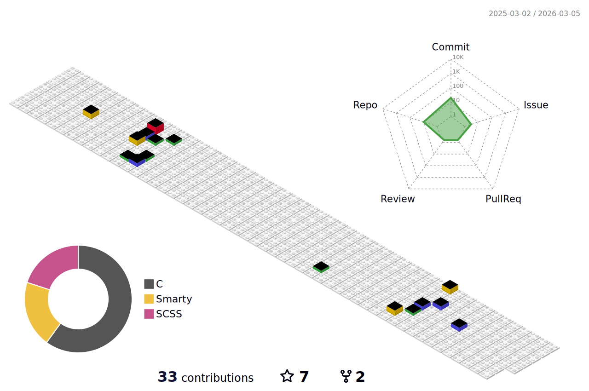

<!-- slogan -->
<h1 align="center">
  <p>Hi There. 👋🤓  </p>
  <br/>

</h1>

<h1 align="center">
  <p align="center">👍👍👍Make Javascript Great Again👍👍👍</p>
</h1>

<!-- 动态打字效果 -->
<!--  <h1 align="center">
  <a href="https://nav.sob.im/">
    
  </a>
</h1>  -->

🎉欢迎来到我的Github! 我是雾山😃。我热爱编程，是一名前端开发工程师，对前端开发、Linux、嵌入式和开源🔥充满热情。我喜欢探索和学习任何新事物❤️ 。

<!-- 个人资料徽标 -->
<div align="center">
 
 <a href="https://github.com/beer-on-ice/"></a>
 <a href="https://github.com/beer-on-ice/"></a>
 <a href="mailto:li997477295@outlook.com"></a>
 <a href="https://www.vuejs.com"></a>
 <a href="https://nodejs.org"></a>
 <a href="https://www.mongodb.com"></a>
 <a href="https://shields.io/"></a>
 <a href="https://www.linkedin.com/in/%E9%94%A6-%E6%9D%8E-239a4b183/"></a>
 <a href="https://blog.orcat.cn"></a>
 
 <a href="https://www.archlinux.org/"></a>
 <a href="https://www.apple.com/"></a>
 <a href="javascript:;"></a>
 <a href="javascript:;"></a>
</div>

<!-- 贪吃蛇代码贡献图 -->
<div align="center"></div>

<!-- 联系我 -->
<details>

<summary>📫 Reach me</summary>
  
  
  
  
- 💬 Ask me about anything.
- 📧 <a href="mailto:mail@sob.im">Email</a>
- 📖 <a href = "https://notion-blog.sob.im/">博客</a>
- 💼 <a href= "https://notion-nav.sob.im/">导航</a>
- ☁️ <a href = "https://list.sob.im/">云盘</a>
  


</details>

### ⚡ Technologies 

#### Front-end:


#### Back-end:


#### Editors and Operating Systems:


<!--  -->


<!-- wakatime 统计 -->
<table align="center">
<tr>
<td valign="top">  
<!--START_SECTION:waka-->
**I'm an Early 🐤** 

```text
🌞 Morning                4097 commits        ████░░░░░░░░░░░░░░░░░░░░░   16.25 % 
🌆 Daytime                15906 commits       ████████████████░░░░░░░░░   63.08 % 
🌃 Evening                5127 commits        █████░░░░░░░░░░░░░░░░░░░░   20.33 % 
🌙 Night                  84 commits          ░░░░░░░░░░░░░░░░░░░░░░░░░   00.33 % 
```
📅 **I'm Most Productive on Friday** 

```text
Monday                   3456 commits        ███░░░░░░░░░░░░░░░░░░░░░░   13.71 % 
Tuesday                  4892 commits        █████░░░░░░░░░░░░░░░░░░░░   19.40 % 
Wednesday                3668 commits        ████░░░░░░░░░░░░░░░░░░░░░   14.55 % 
Thursday                 5337 commits        █████░░░░░░░░░░░░░░░░░░░░   21.17 % 
Friday                   5803 commits        ██████░░░░░░░░░░░░░░░░░░░   23.01 % 
Saturday                 761 commits         █░░░░░░░░░░░░░░░░░░░░░░░░   03.02 % 
Sunday                   1297 commits        █░░░░░░░░░░░░░░░░░░░░░░░░   05.14 % 
```


📊 **This Week I Spent My Time On** 

```text
🕑︎ Time Zone: Asia/Shanghai

💬 Programming Languages: 
No Activity Tracked This Week

🔥 Editors: 
No Activity Tracked This Week

💻 Operating System: 
No Activity Tracked This Week
```


 Last Updated on 19/03/2024 01:23:18 UTC
<!--END_SECTION:waka-->
</td>
</tr>
</table>

<!-- profile-3d-contrib -->


### 👨‍💻 Open source work stats
 
 


<!-- GitHub奖杯🏆 -->
## Analysis :point_down:


Welcome to do ⭐ my repository if you find it interesting, at least your star could make me stay on track and be motivated.

<!-- plugin metrics -->
  

  <p align="center">
    
  </p>
  

<p align="center">
  
</p>
  
### [回到顶部](https://github.com/beer-on-ice/beer-on-ice)
